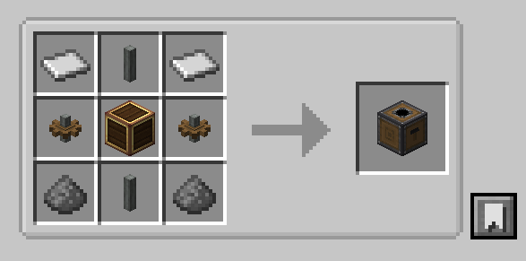
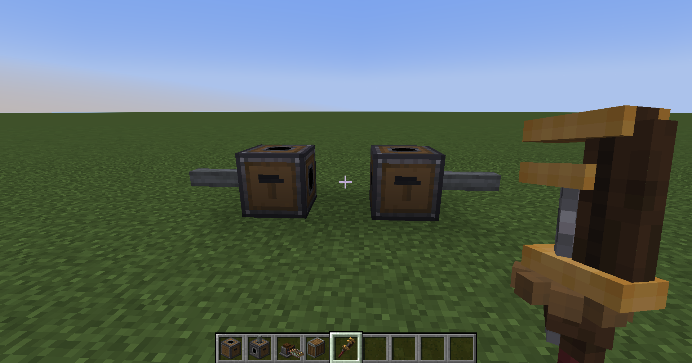
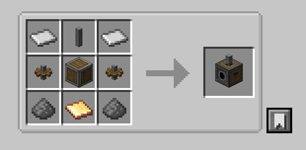
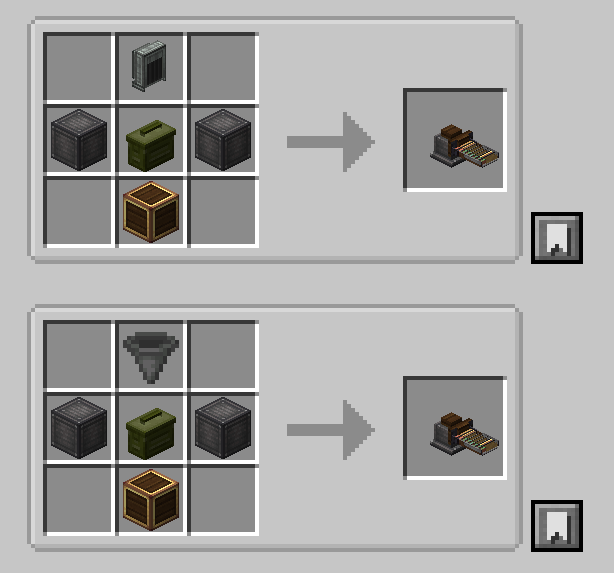
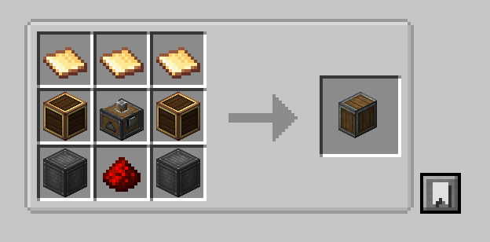

# CBC: Firepower Components Usage Guide

CBC: Firepower Components is an addon for Create Big Cannons. It adds smaller cannon mounts and cleaner ammunition-handling blocks for compact turrets, vehicle mounts, ship guns, and automated loading setups.

## Versions and Dependencies

Current release lines:

- Minecraft 1.21.1 / NeoForge 21.1.x
- Minecraft 1.20.1 / Forge 47.x

Required mods:

- Create
- Create Big Cannons
- Ritchie's Projectile Library

## Added Blocks

- Compact Cannon Mount: a one-block general compact mount for big cannons, drop mortars, autocannons, and handle autocannons.
- Compact Autocannon Mount: a lighter mount made specifically for autocannons.
- Autocannon Ammo Feed: feeds loose autocannon rounds into adjacent assembled compact mounts.
- Cannon Magazine Loader: a three-round external magazine for assembled big cannon mounts.
- Cannon Limiter: a configurable item that installs pitch and yaw limits onto compact mounts.

## Guide Images

The guide uses Markdown images. Already inserted:

- Compact Cannon Mount placement side: `images/placement-compact-cannon-mount.png`
- Compact Cannon Mount recipe: `images/recipe-compact-cannon-mount.png`
- Compact Autocannon Mount recipe: `images/recipe-compact-autocannon-mount.png`
- Autocannon Ammo Feed recipe: `images/recipe-autocannon-ammo-feed.png`
- Cannon Magazine Loader recipe: `images/recipe-cannon-magazine-loader.png`

## General Mount Controls

Both compact mounts follow the same basic control language as Create Big Cannons mounts, but the compact shape makes orientation important.

- Front face: redstone firing control. Signal strength affects firing rate.
- Back face: redstone assembly and disassembly control.
- Top or bottom shaft: yaw control.
- Side shafts: pitch control.
- Wrench the front or back face: swap the firing and assembly sides.
- Wrench a side face: change the horizontal facing of the mount.
- Wrench the top or bottom face: the Compact Cannon Mount rotates horizontally; the Compact Autocannon Mount switches its autocannon mounting face.

After assembly, item input into the mount is forwarded to the mounted cannon. Hoppers, funnels, mechanical arms, and similar item automation can interact with the mount or with this mod's loading blocks.

## Cannon Limiter

The Cannon Limiter is a configurable setup item for both Compact Cannon Mounts and Compact Autocannon Mounts. It does not occupy any firing, assembly, or kinetic input face. When installed, a small limiter model is rendered on the mount so you can see that the mount is limited.

Configurable rows:

- Pitch lower limit
- Pitch upper limit
- Left yaw limit
- Right yaw limit

Use:

1. Right-click air with the Cannon Limiter to open its configuration screen.
2. Enable the rows you want and set each angle with the slider or number box.
3. Right-click a compact mount with the configured limiter to install it.
4. Sneak-right-click the mount with a limiter item to remove the installed limiter and clear the mount limits.

Angle notes:

- Pitch limits use the mount's local pitch angle.
- Yaw limits use the signed yaw offset from the mount's neutral forward direction, not the absolute world direction.
- If no limits are set, the mount behaves the same as an unrestricted compact mount.
- The limiter works on both compact mount types; the Compact Autocannon Mount still accepts autocannons only.
- Goggles show the current limiter state on the mount.

Typical setup:

1. Configure one Cannon Limiter with the safe pitch and yaw range for the turret.
2. Install it into the compact mount.
3. Run the kinetic controls normally; the mount clamps movement at the installed limits.
4. Sneak-right-click the mount to remove the limiter if you need to reconfigure or cancel the limits.

## Compact Cannon Mount





The Compact Cannon Mount is the general-purpose compact mount.

It can mount:

- Create Big Cannons big cannons
- Create Big Cannons drop mortars
- Create Big Cannons autocannons
- Create Big Cannons handle autocannons

Placement:

1. Place the Compact Cannon Mount.
2. Place the cannon structure on the side with the protruding left shaft.
3. Power the back face with redstone to assemble the cannon.
4. Power the front face with redstone to fire.

Faces and inputs:

- Protruding shaft side: place the cannon structure here.
- Front face: redstone firing control only.
- Back face: redstone assembly/disassembly control only.
- Top/bottom shaft: kinetic input for yaw.
- Side shafts: kinetic input for pitch.
- Item input: after assembly, inserted items are forwarded to the mounted cannon.

Orientation:

- Wrench the front or back face to swap firing and assembly sides.
- Wrench a side face to change the mount facing.
- Wrench the top or bottom face to rotate the mount horizontally.
- To change the vertical mounting state of the general Compact Cannon Mount, remove and place the mount again.

## Compact Autocannon Mount



The Compact Autocannon Mount is autocannon-only. It does not accept big cannons or drop mortars.

It can mount:

- Create Big Cannons autocannons

Placement:

1. Place the Compact Autocannon Mount.
2. Place an autocannon on the current mounting face.
3. Power the back face with redstone to assemble it.
4. Power the front face with redstone to fire.

Faces and inputs:

- Autocannon mounting face: place the autocannon here.
- Front face: redstone firing control.
- Back face: redstone assembly/disassembly control.
- Top/bottom shaft: kinetic input for yaw.
- Side shafts: kinetic input for pitch.
- Item input: after assembly, inserted items feed the mounted autocannon.

Orientation:

- Wrench the front or back face to swap firing and assembly sides.
- Wrench a side face to change the mount facing.
- Wrench the top or bottom face to switch the autocannon mounting face.

The Compact Autocannon Mount pairs well with the Autocannon Ammo Feed.

## Autocannon Ammo Feed



The Autocannon Ammo Feed moves loose autocannon rounds into an adjacent Compact Autocannon Mount. When placed next to the mount, its belt automatically faces and connects to the mount, letting hoppers, funnels, mechanical arms, and similar automation insert ammunition.

Accepted input:

- Loose autocannon ammunition

Not accepted:

- Full autocannon ammo containers
- Big cannon projectiles
- Big cartridges
- Normal items

Usage:

1. Place the Autocannon Ammo Feed next to a Compact Autocannon Mount.
2. Insert loose autocannon rounds using hoppers, funnels, mechanical arms, or other item transport.
3. The feed automatically turns toward the adjacent mount and keeps trying to push rounds into the assembled autocannon.

Faces and inputs:

- Any face can accept loose autocannon ammunition.
- The feed has no fixed output face; its belt faces the adjacent Compact Autocannon Mount.
- If the mount is not assembled or the autocannon input buffer is full, ammunition remains stored in the feed.

Notes:

- The feed handles loose autocannon rounds only, not full ammo containers.
- The feed must be placed directly next to the mount; it will not feed across a gap or through another block.
- Full autocannon ammo containers can be inserted into the assembled mount directly.

## Cannon Magazine Loader



The Cannon Magazine Loader is a three-round external magazine for big cannons. Place it directly next to a cannon mount; it caches ammunition for faster follow-up shots. It is not used for autocannons.

Accepted input:

- Big cannon projectiles
- Big cannon fuzes, if a stored projectile can accept one
- Powered big cartridges

Not accepted:

- Loose autocannon ammunition
- Autocannon ammo containers
- Fuzes when no compatible unfuzed projectile is stored
- Empty big cartridges as propellant
- Normal items

The important slot rule:

- Upper three slots: projectiles.
- Lower three slots: powered big cartridges.
- Each column is one round: projectile above, matching cartridge below.
- Fuzed projectiles must receive a fuze before that column is considered ready.
- The loader feeds each round as projectile first, then the matching powered cartridge.

Manual use:

1. Right-click with a big cannon projectile to place it into the upper row.
2. If that projectile needs a fuze, right-click with a fuze to attach it to the stored projectile.
3. Right-click with a powered big cartridge to place it into the lower row.
4. Empty-hand right-click a visible slot to remove that item.

Automated input:

- Automated projectile input fills empty upper-row slots first.
- Automated fuze input attaches the fuze to the first stored fuzed projectile that does not already have one.
- Automated powered-cartridge input only goes under a column that already has a projectile.
- Once automation starts filling the loader, it waits until all three columns are complete before starting the loading cycle.
- For fuzed projectiles, "complete" means projectile plus fuze plus powered cartridge. Non-fuzed projectiles only need the projectile and powered cartridge.
- Manual insertion and removal are always allowed.

Connection to mounts:

- The loader must be placed next to an assembled big cannon mount.
- It can feed adjacent compact cannon mounts or Create Big Cannons big cannon mounts.
- It loads projectile first, then the matching powered cartridge.
- Fuzes are stored on the cached projectile item before loading; they are not inserted into the cannon as a separate loading step.

Empty cartridge output:

- The loader tries to remove spent empty big cartridges from adjacent mounted big cannons.
- Empty big cartridges are stored inside the loader.
- Sides, back, and bottom can output empty big cartridges to hoppers, funnels, and similar automation.
- Front and top are better used as input faces and do not serve as empty-cartridge output faces.
- Automation will not extract unfired projectiles or powered cartridges from the output faces.

## Survival Recipes

Compact Cannon Mount:

```text
Iron Plate      Shaft         Iron Plate
Cogwheel        Brass Casing  Cogwheel
Gunpowder       Shaft         Gunpowder
```

Compact Autocannon Mount:

```text
Iron Plate      Shaft            Iron Plate
Cogwheel        Andesite Casing  Cogwheel
Gunpowder       Brass Sheet      Gunpowder
```

Autocannon Ammo Feed:

```text
Empty                 Hopper/Andesite Funnel      Empty
Industrial Iron Block Autocannon Ammo Container   Industrial Iron Block
Empty                 Brass Casing                Empty
```

Cannon Magazine Loader:

```text
Brass Sheet           Brass Sheet    Brass Sheet
Brass Casing          Cannon Loader  Brass Casing
Industrial Iron Block Redstone       Industrial Iron Block
```

Cannon Limiter:

```text
Empty        Shaft           Empty
Brass Sheet  Redstone        Brass Sheet
Empty        Andesite Alloy  Empty
```

## Troubleshooting

The mount does not assemble:

- Make sure the cannon is on the correct mounting face.
- Make sure the back face is powered.
- Make sure the cannon structure can be assembled normally by Create Big Cannons.

The mount does not rotate:

- Check that yaw and pitch are connected to the correct shaft inputs.
- Check kinetic speed and direction.
- Check whether the assembled cannon is blocked or stalled.
- Check the Cannon Limiter goggle tooltip; a saved pitch or yaw limit may be stopping the mount.

The Autocannon Ammo Feed does not feed:

- Make sure it contains loose autocannon rounds.
- Make sure the adjacent compact mount is assembled and is carrying an autocannon.
- Make sure the autocannon input buffer is not full.

The Cannon Magazine Loader does not start:

- With automated input, the loader waits for all three columns to be complete.
- Make sure each column has a projectile and a matching powered big cartridge.
- If the projectile accepts a fuze, make sure a fuze has been inserted after the projectile.
- Make sure the loader is adjacent to an assembled big cannon mount.
